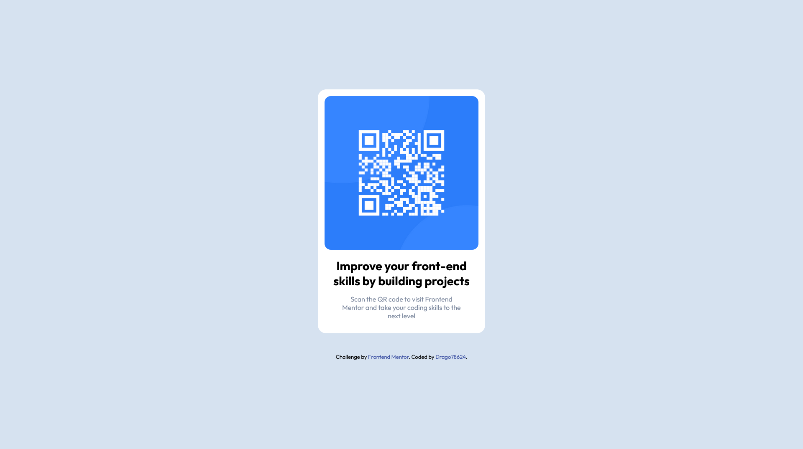

# Frontend Mentor - QR code component solution

This is a solution to the [QR code component challenge on Frontend Mentor](https://www.frontendmentor.io/challenges/qr-code-component-iux_sIO_H). Frontend Mentor challenges help you improve your coding skills by building realistic projects. 

### Screenshot

### Links

- Solution URL: (https://github.com/Drago78624/FEM-qr-code-component)
- Live Site URL: (mystifying-carson-008e62.netlify.app)

## My process

### Built with

- Flexbox
- Mobile-first workflow

### Continued development

i will try to build more of frontendmentor projects to improve my skills and avoid unnecessary stuff in my code in future projects

## Author

- Frontend Mentor - [@Drago78624](https://www.frontendmentor.io/profile/Drago78624)

